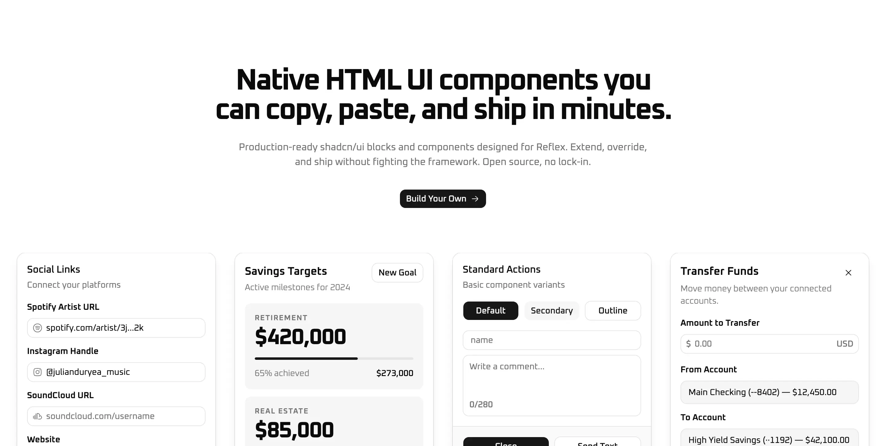

# buridan/native

Native HTML UI components you can copy, paste, and ship in minutes. Built for Reflex. Open Source.

Production-ready shadcn/ui blocks and components designed for Reflex. Extend, override, and ship without fighting the framework. Open source, no lock-in.

  

## Documentation

Visit the [Introduction](https://native.buridan.dev/docs/getting-started/introduction) page to get started.

## Command Line Interface (CLI)

Visit the [CLI](https://native.buridan.dev/docs/getting-started/cli) page for information on how to use the CLI tool.

## Components

Visit [Components](https://native.buridan.dev/components) section to see all available components.

## Create

Visit [Create](https://native.buridan.dev/create) to visually build your own theme set.

## Typeset

Visit [Typeset](https://native.buridan.dev/typeset) to visually build your own typeset.

## Contributing

Please read this [guide](CONTRIBUTING.md) for more information on how to contribute.

## License

Licensed under the [MIT license](LICENSE.md).
